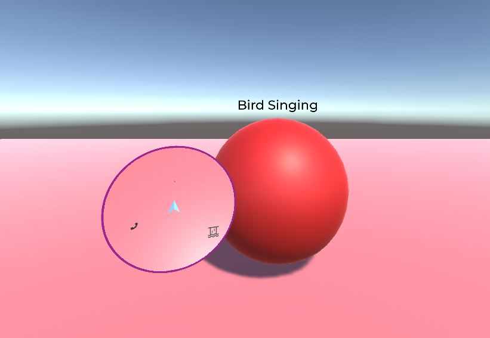
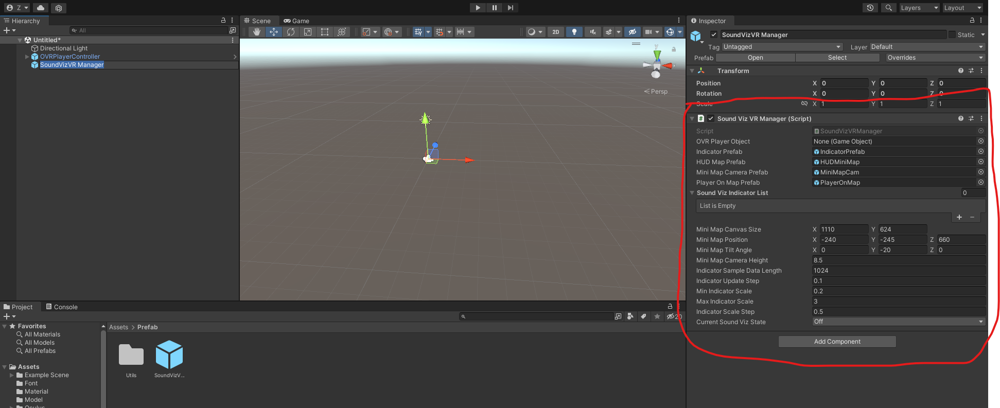

# SoundVizVR Plugin Documentation

# Introduction

SoundVizVR is a sound visualization plugin package for Unity VR projects. (For now, only Oculus VR devices are supported.)

SoundVizVR uses iconic and textual sound visualization representation methods on the Head-Up Display (HUD) minimap and environmental indicators to improve the accessibility of spatial sounds in VR.



The SoundVizVR plugin binds the sound visualization indicator with the pre-defined descriptive text or icon to a sound source object in the Unity scene. Its textual and iconic representation methods enable the VR user to “see” the existence, loudness, duration, and sound type of the noises made by the sounding object.

In the Unity scene, the sound indicator will show up in the environment and on the HUD minimap once it detects the binding object is making sounds. Meanwhile, the indicator will dynamically change its size to reveal the loudness of the sounds (scales up when the loudness goes up and scales down when the loudness goes down).

# Demo

## Game

A VR game named **"Animal Treasure Hunt"** which is designed and developed by *Huadong Zhang (@zhd407108459)* with the SoundVizVR plugin integrated to improve its sound accessibility.

**[Download Link](https://drive.google.com/file/d/1slz3EIMAZ6aer-qOZE_kTgHQMJr-zKZP/view?usp=sharing)**

*For more details, please refer to its README.txt file.*

## Video

A demo video related to our preliminary research of the plugin: (you may see what the plugin looks like in 1:44 - 2:07)

[https://youtu.be/Yn1pe2mMHnA](https://youtu.be/Yn1pe2mMHnA)

# Compatibility

- Support Unity `≥ 2021.3.3f1`
- Support Oculus Integration up to `39.0`

# Supported VR Headsets

- Oculus Quest (via Oculus Link)
- Oculus Quest 2 (via Oculus Link)
- Oculus Rift S

# Install

## Before you start

1. Make sure the latest **[Oculus Integration package](https://assetstore.unity.com/packages/tools/integration/oculus-integration-82022)** has been imported into your Unity VR project
2. Make sure there is an **OVRCameraRig** or **OVRPlayerController** prefab object that exists in your project hierarchy. If not, you may find and import either prefab in this location: **Assets/Oculus/VR/Prefabs** *(You can see this folder when the **Oculus Integration** package has been imported)*


1. Make sure the **XR Plug-in Management** in the **Project Settings** is installed, and the **Oculus** checkbox under the Windows tab is checked


> If you need help in setting up an Oculus development environment on your PC, you may find this article helpful: [6 Steps to Set Up Your Oculus Rift with Unity in Less Than 10 Minutes [2021 Update] | Circuit Stream](https://circuitstream.com/blog/oculus-unity-setup/)
> 

## Import the package

*[From Unity editor:](https://docs.unity3d.com/560/Documentation/Manual/AssetPackages.html)*

1. In the menu bar, choose **Assets > Import Package > Custom Package…,** and the **Import Unity Package** dialog box displays. Find and import the **SoundVizVR.unitypackage** file with all the items in the package pre-checked, and ready to install.
2. Select **Import** and Unity puts the contents of the package into a **SoundVizVR** folder, which you can access from your **Project View**.


# How To Use

1. In the **Project View**, navigate to **Assets** / **SoundVizVR** / **Prefab**.
2. From there, click and drag the **SoundVizVR Manager** prefab into your scene.
    
    
    
3. Click on the **SoundVizVR Manager** object in the **Hierarchy View**, so you can view its properties in the inspector



4. Drag the **OVRCameraRig** or **OVRPlayerController** object to the `OVR Player Object` field of the **SoundVizVR Manager** component in the inspector


5. Create some **SoundVizVR Indicator** items inside the **Sound Viz Indicator List** by clicking on the “**Plus**” button. Then, fill in the blank of each item. (Don’t forget to bind the indicator to the existing spatial sound source in the scene by dragging the sound source object from the **Hierarchy View** to the `Binding Object` field of an item.)


6. Specify the state of the sound visualization by choosing an option in the **Current Sound Viz State**


7. Add a “**Map**” layer in the Layers editor


8. In the **Hierarchy View**, locate **OVRCameraRig > TrackingSpace > CenterEyeAnchor** (or OVRPlayerController > OVRCameraRig > TrackingSpace > CenterEyeAnchor).


Then, locate **Camera > CullingMask** in the **CenterEyeAnchor's Inspector**. In its dropdown menu, uncheck the **"Map"** item.


9. Well done! You are all set.

# Example Scene

There is an example scene for your reference in the package: **SoundVizVR** / **Example Scene** / **Example.** It might help you get a better idea of using the SoundVizVR plugin in a Unity VR project.


# Options

## SoundVizVR Manager (required)

| Option | Description | Type | Default |
| --- | --- | --- | --- |
| OVR Player Object | The existing OVR camera object in the hierarchy (Either OVRCameraRig or OVRPlayerController from the folder Oculus>VR>Prefabs is recommended) | GameObject |
| Indicator Prefab | The Sound Indicator prefab that attaches to a spatial sound source | Prefab (GameObject) | IndicatorPrefab (Located in SoundVizVR/Prefab/Utils) |
| HUD Map Prefab | The Minimap prefab that attaches to the HUD UI | Prefab (GameObject) | HUDMiniMap (Located in SoundVizVR/Prefab/Utils) |
| Mini Map Camera Prefab | The Camera prefab to render the minimap’s texture | Prefab (GameObject) | MiniMapCam (Located in SoundVizVR/Prefab/Utils) |
| Player On Map Prefab | An arrow prefab to indicate the player’s location on the minimap | Prefab (GameObject) | PlayerOnMap (Located in SoundVizVR/Prefab/Utils) |
| Sound Viz Indicator List | List of SoundViz Indicators in the scene | SoundVizIndicator Object |  |
| Mini Map Canvas Size | The dimension of the HUD UI canvas | Vector2 (X, Y) | (1110, 624) |
| Mini Map Position | The MiniMap’s position on the HUD UI canvas | Vector3 (X, Y, Z) | (-240, -245, 660) |
| Mini Map Tilt Angle | The MiniMap’s tilt angle on the HUD UI canvas | Vector3 (X, Y, Z) | (0, -20.0, 0) |
| Mini Map Camera Height | The height of the MiniMap’s camera. It relates to the field of view (FoV) of the map. (Increase the number if you want a bigger FoV) | float | 8.5 |
| Indicator Sample Data Length | The number of samples of the sound source audio. | int | 1024 |
| Indicator Update Step | The update rate of the indicator | float | 0.1 |
| Min Indicator Scale On Mini Map | The minimal scale of the indicator on Mini Map | float | 0.2 |
| Max Indicator Scale On Mini Map | The maximal scale of the indicator on Mini Map | float | 3.0 |
| Min Indicator Scale On Env | The minimal scale of the environmental indicator | float | 0.07 |
| Max Indicator Scale On Env | The maximal scale of the environmental indicator | float | 1.05 |
| Mini Map Opacity | The opacity of the Mini Map (ranges from 0.0 - 1.0) | float | 1.0 |
| Indicator Scale Step | The rate of change of the indicator during the transition. (Reduce the number if you want a smoother transition.) | float | 0.5 |
| Current Sound Viz State | The view of the sound visualization. (Available Options: Off, IconMapWithIconTag, IconMapWithTextTag, TextMapWithIconTag, TextMapWithTextTag) | SoundVizType | SoundVizType.Off |

## SoundVizVR Indicator Object

| Option | Description | Type | Default |
| --- | --- | --- | --- |
| Name | The tag name of the SoundViz indicator | string | “Indicator” |
| Descriptive Text | The descriptive text of the indicator. Show on IconMapWithTextTag, TextMapWithIconTag, and TextMapWithTextTag mode. | string |  |
| Indicator Icon | The icon of the indicator. Show on IconMapWithIconTag, IconMapWithTextTag, and TextMapWithIconTag mode. | Sprite |  |
| Binding Object | The sound source object the indicator attaches to. | GameObject |  |
| Indicator Scale | The initial scale of the indicator | Vector3 (X, Y, Z) | (0.2, 0.2, 0.2) |
| Indicator Height | The offset height of the indicator to an object | float | 0.0 |

# Methods

## SoundVizVR Manager

### SetSoundVizState

Programmatically change the state of the SoundVizVR Sound Visualization. 

```csharp
SoundVizVRManager.instance.SetSoundVizState((int)mySoundVizType)
```

**Parameter**: (int)`SoundVizType` 

Available options: 

- `SoundVizType.Off`
- `SoundVizType.IconMapWithIconTag`
- `SoundVizType.IconMapWithTextTag`
- `SoundVizType.TextMapWithIconTag`
- `SoundVizType.TextMapWithTextTag`

# Q&A

If you have any other questions about this plugin, contact me (Ziming) via zl1398[at]rit.edu 

# **Credits**

## Audio

- Bird Song [Public Domain] by Jc Guan: [https://soundbible.com/340-Bird-Song.html](https://soundbible.com/340-Bird-Song.html)
- Phone Ringing [Attribution 3.0] by acclivity: [https://soundbible.com/1518-Phone-Ringing.html](https://soundbible.com/1518-Phone-Ringing.html)
- Large Waterfall [Attribution 3.0] by Daniel Simion: [https://soundbible.com/2201-Large-Waterfall.html](https://soundbible.com/2201-Large-Waterfall.html)

## Icon

- River icons created by Freepik - Flaticon: [https://www.flaticon.com/free-icons/river](https://www.flaticon.com/free-icons/river)
- Bird icons created by deemakdaksina - Flaticon: [https://www.flaticon.com/free-icons/bird](https://www.flaticon.com/free-icons/bird)
- Phone icons from font awesome [Creative Commons Attribution 4.0 International]: [https://fontawesome.com/license](https://fontawesome.com/license)

## Model

- Arrow models created by morelw - [Clara.io](http://Clara.io): [Arrow · free 3d model · Clara.io](https://clara.io/view/0c08ec76-e2a0-4813-ba85-747c1e81721f#)

## Font

- Montserrat [SIL OPEN FONT LICENSE Version 1.1]
